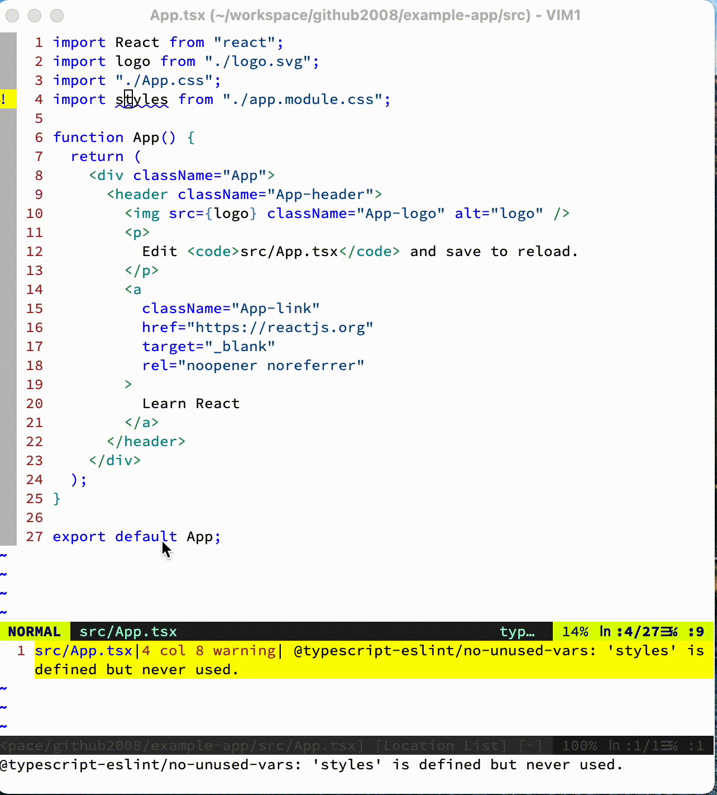
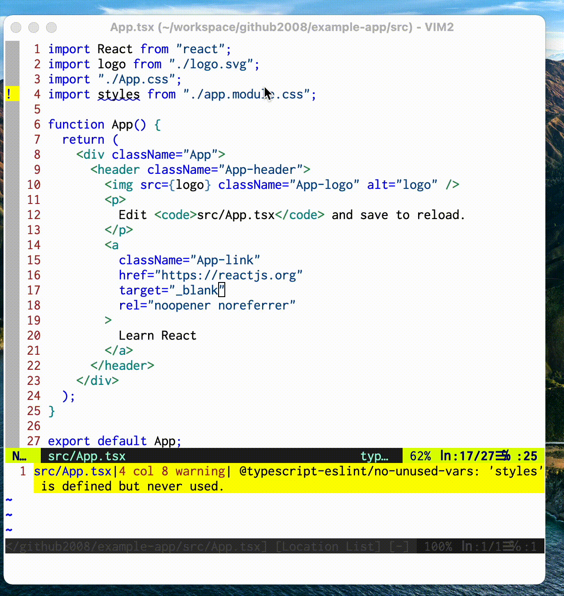

# Example App

## Create App

1. create app: `npx create-react-app example-app --template typescript`
1. edit `tsconfig.json`: https://github.com/mrmckeb/typescript-plugin-css-modules
1. add `src/app.module.css` and import it in `src/App.tsx`

## Code Completion When Editing

1.  run `yarn install`
1.  open `src/App.tsx`
1.  try to edit at line `5` with insert `styles.` and wait for code completion

## YCM + `--ts-completer`

## [vim-lsp](https://github.com/prabirshrestha/vim-lsp) + [mattn/vim-lsp-settings](https://github.com/mattn/vim-lsp-settings) (typescript-language-server)

